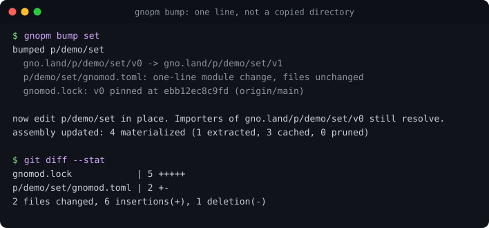
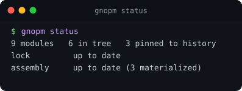
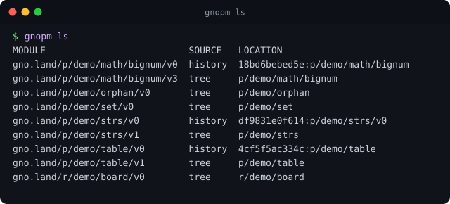
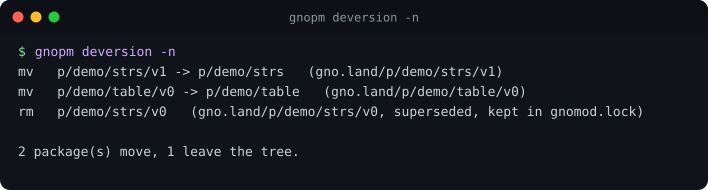
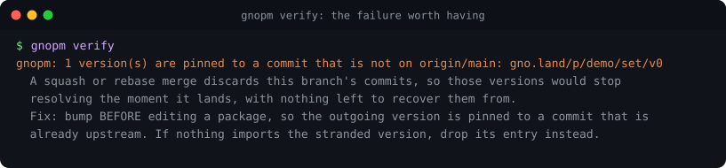

# gnopm

[](https://github.com/moul/gnopm/actions/workflows/ci.yml)
[](https://pkg.go.dev/moul.io/gnopm)
[](https://goreportcard.com/report/moul.io/gnopm)
[](#license)
[](https://github.com/moul/gnopm/tags)
[](https://github.com/moul/gnopm-demo)

**A package manager for [gno](https://gno.land) workspaces.** It keeps a
package's version in its `gnomod.toml` instead of in its directory name,
records where every version's source actually is in a `gnomod.lock`, and
rebuilds the versions that are no longer in the working tree so that pinned
imports still resolve.

```
p/alice/md/gnomod.toml     module = "gno.land/p/alice/md/v1"
p/alice/md/md.gno          edited in place
```

<p align="center">
  
</p>

`p/alice/md/` publishes to `gno.land/p/alice/md/v1`. There is no `v1/`
directory, and there never was a `v0/` one either: `v0` is pinned in
`gnomod.lock` to a commit, and `gnopm sync` rebuilds it under `.gnopm/` for
anything that still imports it.

## Install

```sh
go install moul.io/gnopm@latest
```

## Why a directory should not carry the version

A gno package path ends in its version, so the obvious layout mirrors the path
and gives each version its own directory. Bumping then means copying the
directory and editing the copy.

**git cannot pair a copy.** The review diff of a version bump becomes a set of
added files with no content diff at all, which is backwards: a bump is by
definition the compatibility change that most needs reviewing, and it is the
one change you cannot see. `git log --follow`, `git blame` and `git bisect` all
stop at the copy too. One real port of 25 realms landed as **+11,103 / -0
across 112 files**, with every behaviour change invisible.

gnopm removes the copy. The toolchain already reads the version from the module
line, so the directory does not have to repeat it.

> Verified against gno master: a directory named `zzz/` declaring
> `gno.land/p/probe/foo/v1` is resolved by a sibling importing that path, and an
> import absent from the workspace genuinely fails to resolve, so resolution
> really happens rather than being masked by a later error.

**[moul.github.io/gnopm](https://moul.github.io/gnopm/)** has the same thing with pictures.

## Quickstart

<p align="center">
  
</p>

```sh
gnopm status      # what resolves, and whether anything is out of date
gnopm sync        # make the state good
gnopm bump md     # promote a package, in place; then edit the files
gnopm ls          # every module and where its source is
gnopm verify      # prove every pinned version still reproduces (for CI)
```

Two of those are the ones you type: `status` to ask, `sync` to fix. There is no
separate "write the lock" and "fetch the versions" step, because having both
only raises the question of which one you wanted.

<p align="center">
  
</p>

Migrating a repository that still has versioned directories:

```sh
gnopm deversion -n    # the plan
gnopm deversion       # do it, as git renames
```

<p align="center">
  
</p>

## Commands

```
gnopm status            what the workspace resolves, and what is out of date
gnopm sync              make the state good
gnopm bump <package>    promote a package to its next version, in place
gnopm ls [pattern]      list resolvable modules and where their source is
gnopm verify            prove every pinned version still reproduces (CI)
gnopm tidy              drop pinned versions nothing imports that never shipped
gnopm env               what gnopm worked out about this workspace
gnopm version           what this binary is
gnopm deversion         one-time migration off versioned directories
```

`<package>` is a directory, a module path, or any unambiguous part of one, so
`p/alice/md`, `gno.land/p/alice/md/v0` and `md` all resolve to the same
package. With no argument at all, `bump` uses the package you are standing in.
Flags may appear before or after positionals, and `-C <dir>` works like
`git -C`.

**Data goes to stdout and nothing else does**, so it pipes:

```sh
gnopm ls -q | xargs -n1 gno lint
gnopm ls -pinned -json | jq -r '.[].commit'
gnopm status -json | jq -e .ok
```

## Design, in five claims

1. **If gnopm can work something out, it works it out.** A flag is an admission
   that it could not. `verify` detects the upstream ref from `GITHUB_BASE_REF`
   or `origin/HEAD`; `bump` infers the package from your working directory.
2. **A build never mutates the lock.** Only `sync` and `bump` write.
3. **The lock is source, not a generated artifact.** A change that bumps a
   version has to carry the pin that keeps the old version resolvable, or CI
   cannot build what still imports it. It changes only on add, remove or bump.
4. **Comments are not data.** The generated header is prose, and prose gets
   edited; making it load-bearing would break every lock in existence over a
   wording change.
5. **No resolver, ever.** A gno import path contains its version, so there is no
   transitive constraint to solve. gno skipped the entire class of problem that
   produces SAT solvers and dependency hell, by accident of path design. The
   right move is to keep not solving it.

## `gnomod.lock`

```toml
lock = 1

[[module]]
module = "gno.land/p/alice/md/v0"
source = { commit = "d387abaa3a81...", dir = "p/alice/md/v0" }
hash = "h1:3f9c..."

[[module]]
module = "gno.land/p/alice/md/v1"
source = { dir = "p/alice/md" }
```

Flat, one entry per resolvable module path. `source` is a tagged union with
four variants specified and two implemented. `hash` is `h1:`, the same
construction as a `go.sum` line, over every git-tracked file in the directory
at that commit. A `{ dir }` entry deliberately carries no hash: it points at a
directory somebody is editing right now, and hashing it would rewrite the lock
on every source edit.

Named after the manifest rather than the tool, and placed at the workspace root
only, because that is what every ecosystem does: `Cargo.toml`/`Cargo.lock`,
`package.json`/`package-lock.json`, `Gemfile`/`Gemfile.lock`.

## Which commit a pin goes to

Not `HEAD`. Most repositories squash-merge or rebase-merge, so a branch's
commits never become ancestors of the default branch and are unreachable in a
fresh clone once the branch is deleted. A version pinned to a branch `HEAD`
stops resolving the moment the change lands.

<p align="center">
  
</p>

So pins go to a commit **already on the default branch** holding
byte-identical content, and `verify` fails when one does not, with the remedy:
bump *before* editing, or `gnopm tidy` if the stranded version never shipped
and nothing imports it.

**CI must check out full history.** With `actions/checkout` that is
`fetch-depth: 0`.

## Using it as a library

Everything is in packages so other programs do not have to shell out:

| import | what |
|---|---|
| [`moul.io/gnopm/pkg/gnomodlock`](./pkg/gnomodlock) | the `gnomod.lock` format, with no dependency on the CLI |
| [`moul.io/gnopm/pkg/gnopm`](./pkg/gnopm) | the operations: `Sync`, `Bump`, `Verify`, `Tidy`, `Deversion` |

The repository root is the command and a high-level integration test, nothing
else.

## The pictures cannot rot either

Every terminal image above is generated from **real command output** by
[`scripts/screenshots.sh`](./scripts/screenshots.sh), including the failing
`verify`, which is produced by actually making the mistake it catches. A
screenshot taken by hand stops matching the tool the first time an output line
changes and nobody notices.

```sh
./scripts/screenshots.sh
```

## The demo is the integration test

[`scripts/demo.sh`](./scripts/demo.sh) builds a whole workspace from nothing
and asserts at every step. It needs no network, runs under `go test`, and
publishes to **[moul/gnopm-demo](https://github.com/moul/gnopm-demo)** with
`--push`. A demo that is not executed rots; one that is executed as a test
cannot.

It has already found six defects that unit tests structurally could not reach,
most of them in the seam between the CLI and its own documentation.

## Status

Early, and used in anger on a 193-package repository. The format is meant to
become a convention other gno repositories adopt, which is why it is named
`gnomod.lock` and not `gnopm.lock`.

Direction, open questions and the roadmap live in the
[meta issue](https://github.com/moul/gnopm/issues/2).

## Dependencies

None. The lock parser and the `h1:` hash are standard library.

## License

© 2026 [Manfred Touron](https://manfred.life)

Licensed under the [Apache License, Version 2.0](https://www.apache.org/licenses/LICENSE-2.0) ([`LICENSE-APACHE`](LICENSE-APACHE)) or the [MIT license](https://opensource.org/licenses/MIT) ([`LICENSE-MIT`](LICENSE-MIT)), at your option.
